# Aseprite Add-ons

An appendix to the Medium article, ["How To Script Aseprite Tools in Lua"](https://behreajj.medium.com/how-to-script-aseprite-tools-in-lua-8f849b08733). Copy `dialog` and `support` folders to Aseprite scripts folder. In Aseprite, open scripts from the `dialogs` folder.

## References

For more info, see

- [Aseprite Scripting API](https://github.com/aseprite/api)
- [Aseprite CPP source that receives Lua inputs](https://github.com/aseprite/aseprite/tree/main/src/app/script)
- [Aseprite General Documentation](https://www.aseprite.org/docs/)
  - [Run Aseprite in Debug Mode](https://www.aseprite.org/docs/debug/)
  - [Aseprite Command Line Interface](https://www.aseprite.org/docs/cli/)
- [Example Scripts](https://github.com/aseprite/Aseprite-Script-Examples)
- [Aseprite Forum](https://community.aseprite.org/)
- [Lua Documentation](http://www.lua.org/docs.html)

## Gallery

This repo includes

- An arc (mesh).

  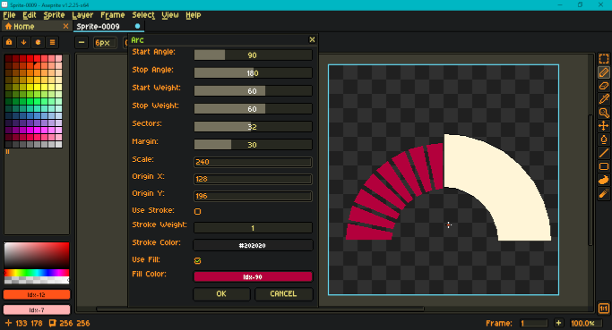

- A brick maker.

  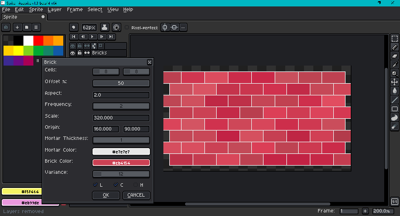

- A checkerboard maker.

  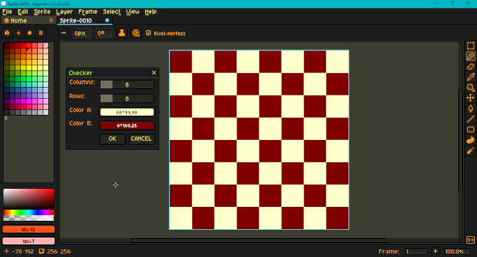

- Color curve presets. ([Test image source](https://en.wikipedia.org/wiki/File:Fire_breathing_2_Luc_Viatour.jpg).)

  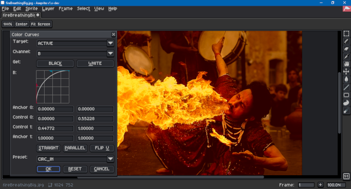

- A conic gradient.

  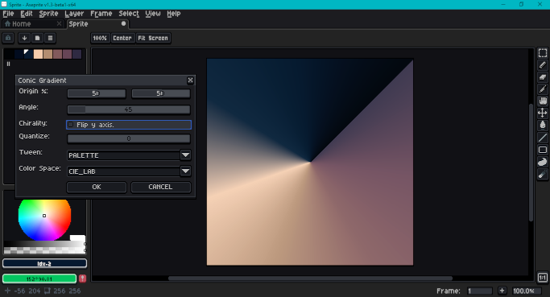

- A hexagon grid generator.

  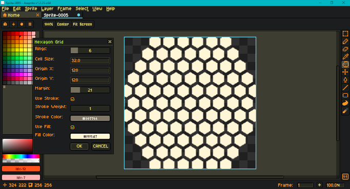

- An animated infinity loop.

  

- A pixel art isometric (dimetric) grid.

  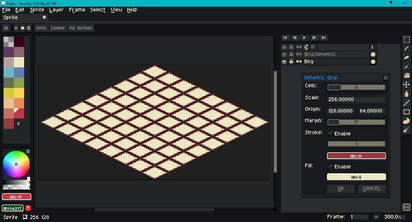

- A linear gradient.
 
  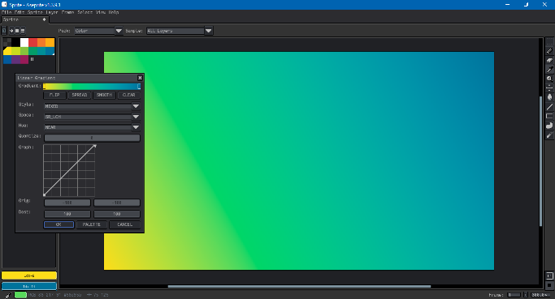

- Luminance (grayscale) remapping. ([Test image source](https://en.wikipedia.org/wiki/File:Fire_breathing_2_Luc_Viatour.jpg).)

  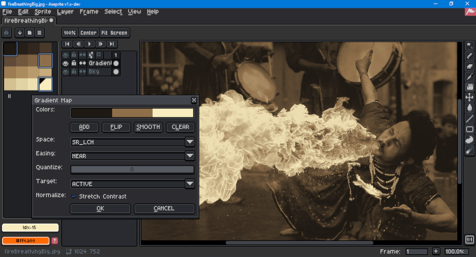

- An RYB palette generator.

  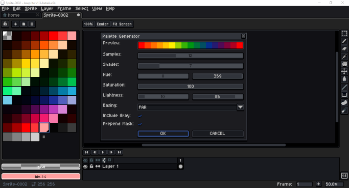

- A regular convex polygon.

  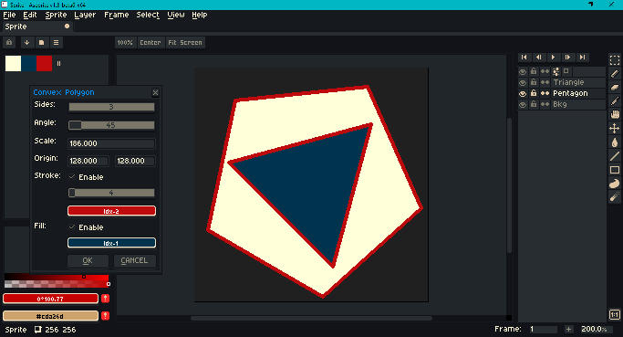

- A polar grid.

  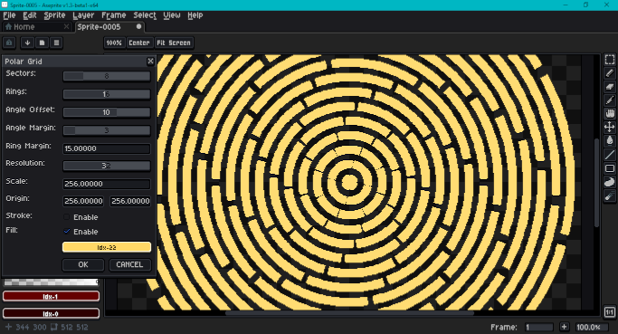

- A radial gradient.

  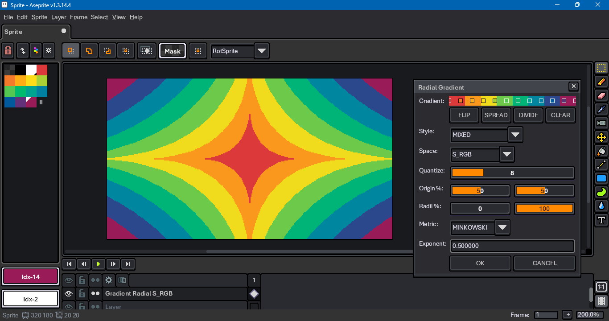

- A rounded rectangle.

  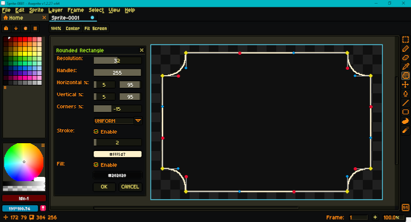

- An animated sine wave example.

  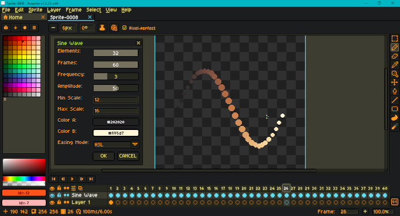

Appearances may vary as features are added to or removed from underlying scripts.