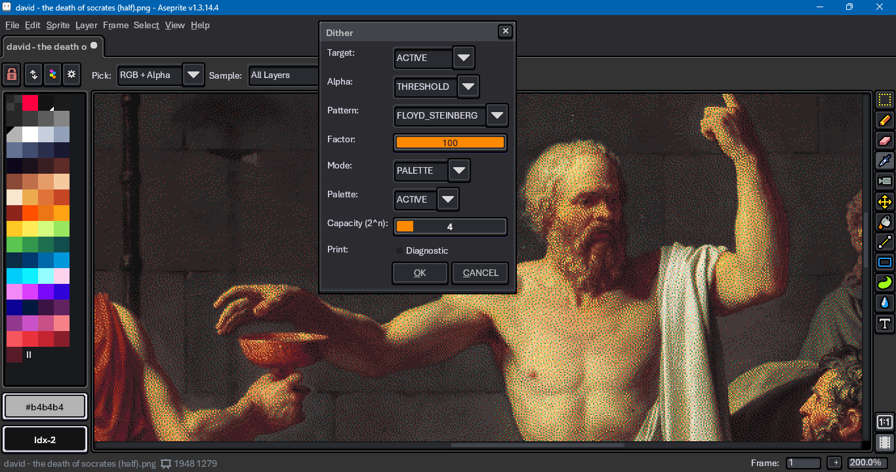
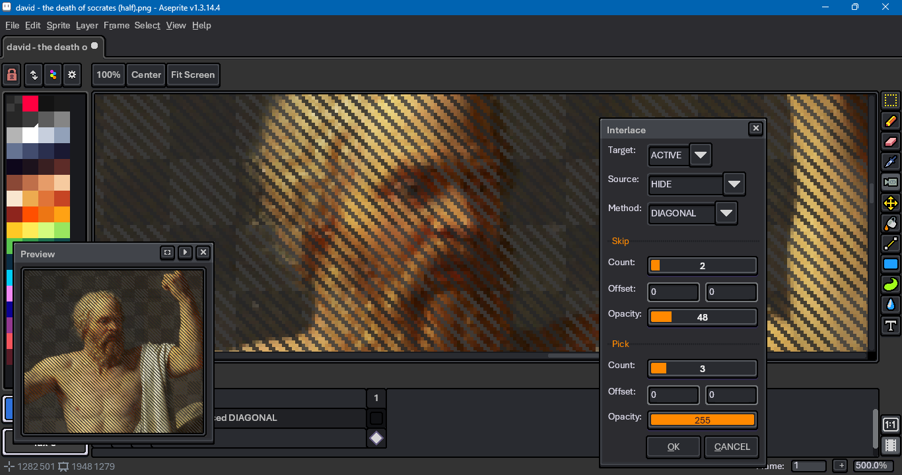
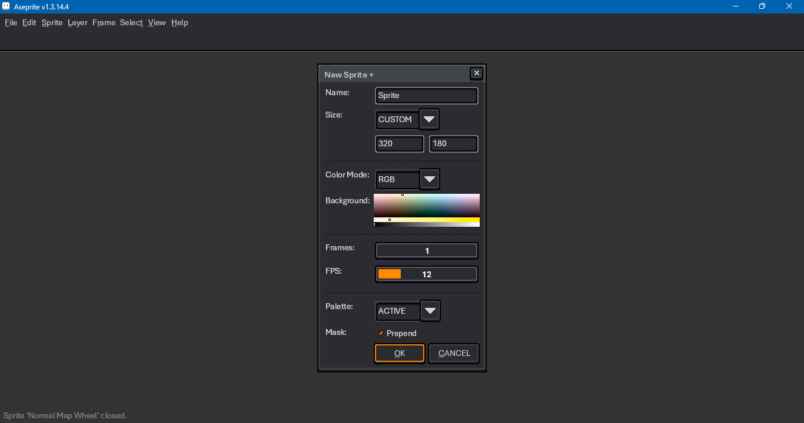
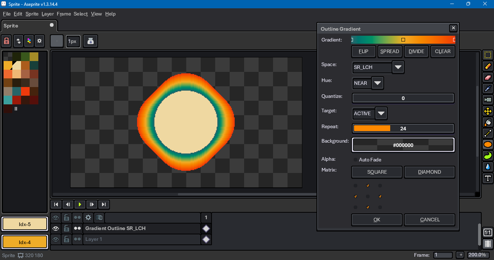
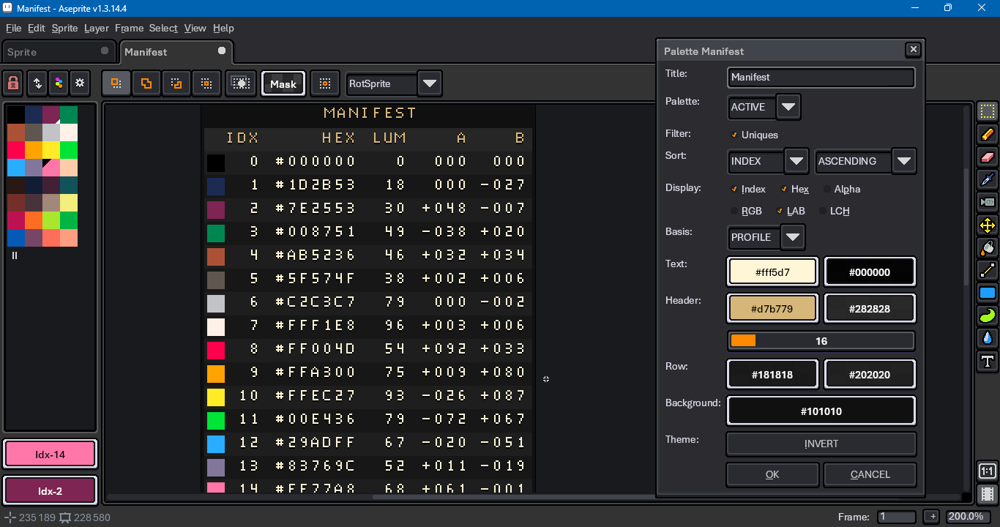

# Aseprite Add-ons

This repository developed out of the Medium article, ["How To Script Aseprite Tools in Lua"](https://behreajj.medium.com/how-to-script-aseprite-tools-in-lua-8f849b08733).

## Installation

To install, click on the green `Code` button above. Select `Download ZIP` from the pop-up menu. Unzip the file after it has finished downloading. In Aseprite, go to `File > Scripts > Open Scripts Folder`. Copy `commands`, `dialog` and `support` folders from the unzipped download into the folder that Aseprite has opened. Return to Aseprite, go to `File > Scripts > Rescan Scripts Folder`.

There is a [known issue](https://community.aseprite.org/t/script-folder-path-cannot-open-no-such-file-or-directory/16818/) when Aseprite's script folder is on a file path that includes characters such as 'é' (e acute) or 'ö' (o umlaut). `dofile` will not interpret relative paths correctly.

## Usage

To use, go to `File > Scripts` and choose from entries in the `dialogs` or `commands` folder.

Scripts can be assigned shortcuts in `Edit > Keyboard Shortcuts`. Dialog buttons can be called by holding down the `Alt` key and pressing the underlined letter of the button's label. For example, `Alt+C` will close dialogs, per the 'C' in "CANCEL".

As of 9 April 2023, Aseprite version 1.3-rc2 is the minimum version needed to run these scripts. It is currently in [beta](https://aseprite.org/beta). This is largely due to the canvas feature.

In dialogs that use custom sliders -- such as the LCH picker, color adjustment and normal picker -- holding down `Ctrl` and clicking will return the slider to a default value, holding down `Shift` and moving the mouse will increment the slider value.

## References

For more resources, see

- [Aseprite Type Definitions](https://github.com/Tsukina-7mochi/aseprite-type-definition)
- [Aseprite CPP source that receives Lua inputs](https://github.com/aseprite/aseprite/tree/main/src/app/script)
- [Aseprite Scripting API](https://github.com/aseprite/api)
- [Lua Documentation](http://www.lua.org/docs.html)
- [Aseprite General Documentation](https://www.aseprite.org/docs/)
  - [Run Aseprite in Debug Mode](https://www.aseprite.org/docs/debug/)
  - [Aseprite Command Line Interface](https://www.aseprite.org/docs/cli/)
- [Aseprite Forum](https://community.aseprite.org/)

## Gallery

This repo includes

- An arc (mesh).

  

- Color curve presets. ([Test image source](https://en.wikipedia.org/wiki/File:Fire_breathing_2_Luc_Viatour.jpg).)

  
  
- A conic gradient.

  

- A Floyd-Steinberg filter ([Test model source](https://www.myminifactory.com/object/3d-print-horseman-at-maria-theresia-platz-152331).)

  

- A hexagon grid generator.

  

- A text insertion dialog.

  

- Interlaced layers. ([Test image source](https://en.wikipedia.org/wiki/File:Fire_breathing_2_Luc_Viatour.jpg).)

  

- A pixel art isometric (dimetric) grid.

  

- LCh color picker.

  

- A linear gradient.
 
  

- Luminance (grayscale) remapping. ([Test image source](https://en.wikipedia.org/wiki/File:Fire_breathing_2_Luc_Viatour.jpg).)

  

- Custom New Sprite

  

- Normal color picker.

  

- Normal from height.

  

- Outline Gradient.

  

- Palette Coverage.

  

- Palette Manifest.

  

- Palette To Cel Assignment.

  

- A regular convex polygon.

  

- A radial gradient.

  

- RGB channel separation.

  

- Basic cel transformation.

  

Appearances may vary as features are added to or removed from underlying scripts.