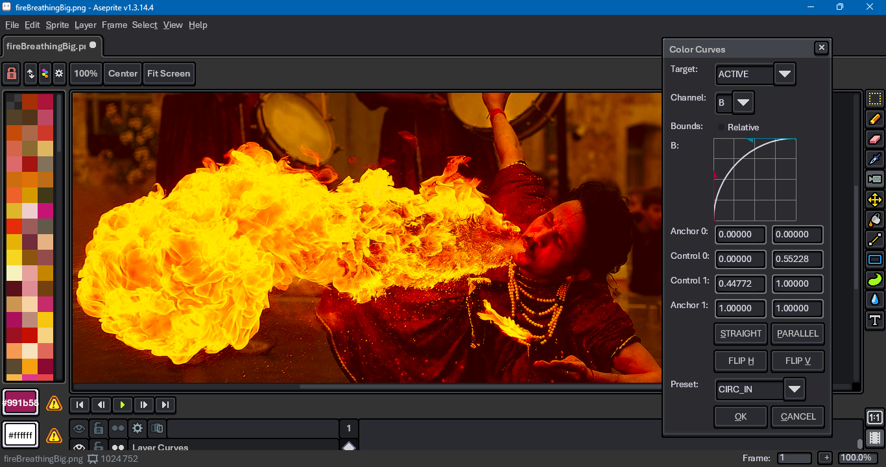
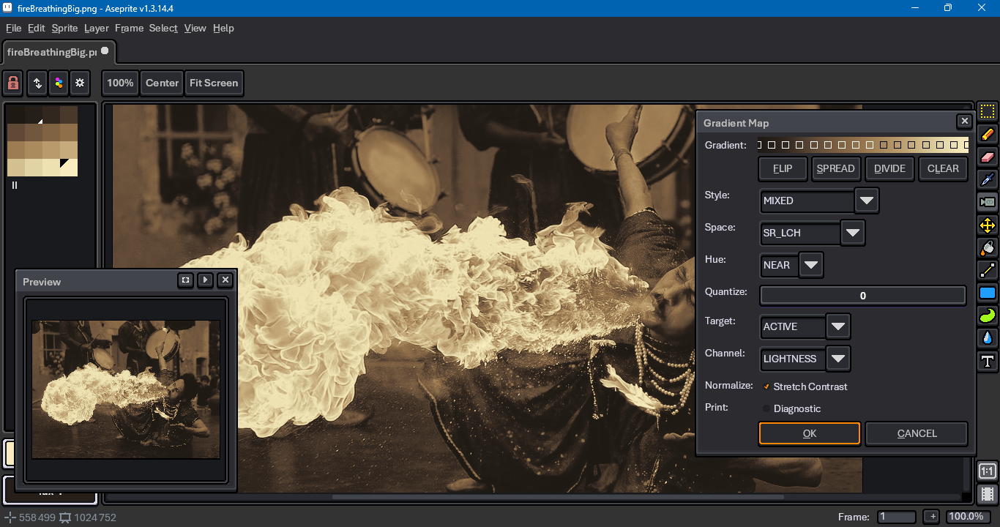

# Aseprite Add-ons

An appendix to the Medium article, ["How To Script Aseprite Tools in Lua"](https://behreajj.medium.com/how-to-script-aseprite-tools-in-lua-8f849b08733).

To install, click on the green `Code` button above. For those unfamiliar with Git, select `Download ZIP`, then unzip the file after it has finished downloading. In Aseprite, go to `File > Scripts > Open Scripts Folder`. Copy `dialog` and `support` folders from the unzipped download into the folder that Aseprite has opened. Return to Aseprite, go to `File > Scripts > Rescan Scripts Folder`.

To use, go to `File > Scripts` and choose from entries in the `dialogs` folder.

## References

For more information, see

- [Aseprite Scripting API](https://github.com/aseprite/api)
- [Aseprite CPP source that receives Lua inputs](https://github.com/aseprite/aseprite/tree/main/src/app/script)
- [Aseprite General Documentation](https://www.aseprite.org/docs/)
  - [Run Aseprite in Debug Mode](https://www.aseprite.org/docs/debug/)
  - [Aseprite Command Line Interface](https://www.aseprite.org/docs/cli/)
- [Example Scripts](https://github.com/aseprite/Aseprite-Script-Examples)
- [Aseprite Forum](https://community.aseprite.org/)
- [Lua Documentation](http://www.lua.org/docs.html)

## Gallery

This repo includes

- An arc (mesh).

  

- A brick maker.

  

- Color curve presets. ([Test image source](https://en.wikipedia.org/wiki/File:Fire_breathing_2_Luc_Viatour.jpg).)

  

- An LCh Color Wheel.

  

- A conic gradient.

  

- A Floyd-Steinberg filter ([Test model source](https://www.myminifactory.com/object/3d-print-horseman-at-maria-theresia-platz-152331).)

  

- A hexagon grid generator.

  

- A custom GPL exporter.

  

- An animated infinity loop.

  

- A text insertion dialog.

  

- A pixel art isometric (dimetric) grid.

  

- LCh color picker.

  

- A linear gradient.
 
  

- Luminance (grayscale) remapping. ([Test image source](https://en.wikipedia.org/wiki/File:Fire_breathing_2_Luc_Viatour.jpg).)

  

- Custom New Sprite

  

- Palette Coverage.

  

- Palette Manifest.

  

- Palette To Cel Assignment.

  

- RGB channel separation.

  

- A regular convex polygon.

  

- A polar grid.

  

- A radial gradient.

  

- A rounded rectangle.

  

Appearances may vary as features are added to or removed from underlying scripts.